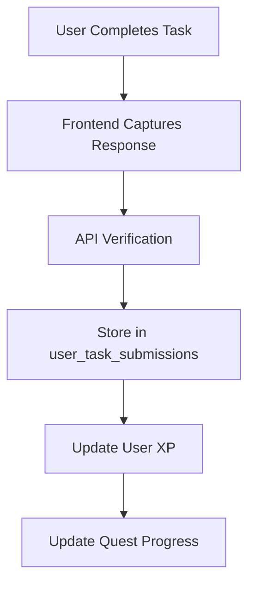

# Task Response System Overview

## Current Status: 🚨 CRITICAL ISSUE

The `user_task_submissions` table is **missing** from your database, which breaks the entire task response system.

## What Should Be Working

### 1. **Task Types & Response Storage**

| Task Type | Response Data | Verification Method |
|-----------|---------------|-------------------|
| **Social Tasks** | `social_username`, `social_post_url` | Real-time API verification |
| **Learn Tasks** | `quiz_answers`, `score` | Quiz scoring with threshold |
| **Manual Tasks** | `submission_data` | Manual verification |
| **Visit Tasks** | `visit_duration`, `timestamp` | Manual verification |
| **Download Tasks** | `download_confirmation` | Manual verification |
| **Form Tasks** | `form_submission_data` | Manual verification |

### 2. **Response Flow**



### 3. **Database Schema (Missing)**

```sql
user_task_submissions {
    id: UUID
    user_id: UUID (references users.id)
    task_id: UUID (references tasks.id)
    quest_id: UUID (references quests.id)
    status: 'pending' | 'completed' | 'verified' | 'rejected'
    submission_data: JSONB
    verification_data: JSONB
    xp_earned: INTEGER
    submitted_at: TIMESTAMP
    verified_at: TIMESTAMP
    verifier_notes: TEXT
    verified: BOOLEAN
    social_username: TEXT
    social_post_url: TEXT
    quiz_answers: JSONB
    manual_verification_note: TEXT
    xp_removed: BOOLEAN
    xp_removal_reason: TEXT
    xp_removed_at: TIMESTAMP
}
```

### 4. **API Endpoints for Responses**

| Endpoint | Purpose | Task Type |
|----------|---------|-----------|
| `/api/verify/learn-completion` | Quiz submissions | Learn |
| `/api/verify/manual-completion` | Manual tasks | Download, Visit, Form |
| `/api/verify/twitter-follow-real` | Twitter verification | Social |
| `/api/verify/discord-join` | Discord verification | Social |
| `/api/verify/telegram-join-real` | Telegram verification | Social |

### 5. **Frontend Components**

- **`QuestDetailClient.tsx`** - Main quest interface
- **`TaskList.tsx`** - Task display and interaction
- **`QuestResponsesViewer.tsx`** - Admin response viewing
- **`TaskVerification.tsx`** - Verification status display

### 6. **Response Management Features**

#### **For Users:**
- ✅ Task completion tracking
- ✅ XP earning and display
- ✅ Progress visualization
- ✅ Quiz submission and scoring
- ✅ Social media verification

#### **For Admins/Creators:**
- ✅ View all user responses
- ✅ Manual verification tools
- ✅ XP removal capabilities
- ✅ Response analytics
- ✅ Quest completion tracking

### 7. **Storage Integration**

The system should integrate with your new storage buckets:
- **`quest-responses`** - Private bucket for user submissions
- **`user-avatars`** - User profile pictures
- **`quest-images`** - Quest cover images

## Current Issues

### ❌ **Critical Problems:**
1. **Missing `user_task_submissions` table** - No response storage
2. **Broken XP tracking** - Can't track earned XP
3. **No quest completion tracking** - Can't determine quest status
4. **Admin response viewing broken** - No data to display

### ⚠️ **Potential Issues:**
1. **Storage integration incomplete** - Need to connect file uploads to responses
2. **RLS policies missing** - Security concerns
3. **Indexes missing** - Performance issues
4. **Triggers missing** - Data consistency issues

## Solution

### **Immediate Action Required:**

1. **Run the SQL script** `create-user-task-submissions-table.sql`
2. **Test the API endpoints** with the new table
3. **Verify frontend integration** works with stored data
4. **Test admin response viewing** functionality

### **Next Steps:**

1. **Connect storage uploads** to task responses
2. **Add response analytics** and reporting
3. **Implement batch operations** for admin management
4. **Add response export** functionality
5. **Create response templates** for different task types

## Testing Checklist

After creating the table:

- [ ] **User can complete a task** and see it marked as completed
- [ ] **XP is awarded** and displayed correctly
- [ ] **Quest progress** updates properly
- [ ] **Admin can view responses** in the response viewer
- [ ] **Quiz submissions** are stored and scored correctly
- [ ] **Social verifications** create proper response records
- [ ] **Manual tasks** can be completed and verified
- [ ] **Storage uploads** are linked to task responses

## Expected Data Flow

```
User Action → Frontend Capture → API Verification → Database Storage → UI Update
```

**Example:**
1. User completes Twitter follow task
2. Frontend calls `/api/verify/twitter-follow-real`
3. API verifies with Twitter API
4. Response stored in `user_task_submissions`
5. User XP updated
6. UI shows task as completed
7. Admin can view response in response viewer 